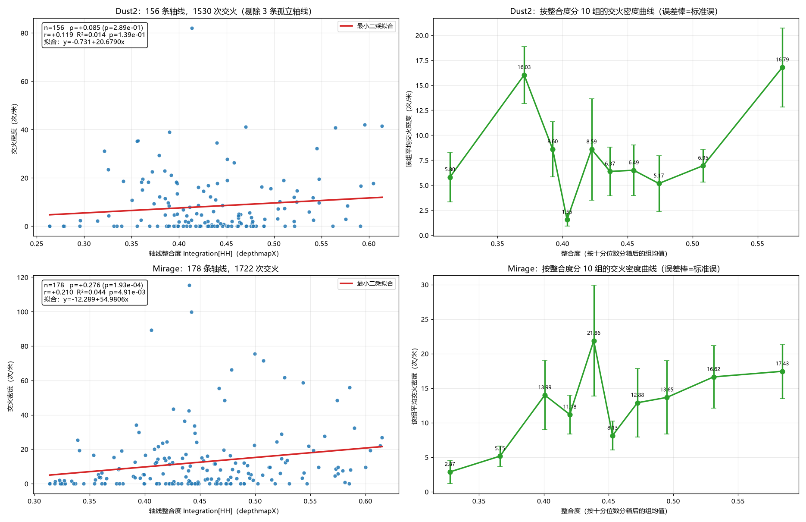

# CS2 空间句法实验：Dust2 与 Mirage 的构形、可理解度与实战行为

用 **Valve 官方导航网格**当"可通行空间"、用 **depthmapX 命令行版**算轴线指标，
把 20 场职业赛 demo 的实战行为（占位、通行流量、交火）映射到同一套空间单元上，
检验空间句法的"自然运动"假设在虚拟空间里是否成立。

**核心结论：运动经济关系不是地图的普遍规律，而是地图依赖的。**

| 行为 × 构形 | Dust2 | Mirage |
|---|---|---|
| 米制整合度 × 占位（VGA 口径，Spearman ρ） | **+0.436** | +0.150 |
| 米制整合度 × 通行流量（VGA 口径） | **+0.430** | +0.125 |
| 整合度 × 交火密度（轴线口径） | +0.0854（p=0.289） | **+0.2759**（p=0.000193） |
| 可理解度 R²（轴线口径） | 0.0284 | **0.1039** |
| 可理解度 R²（VGA 口径，交叉验证） | 0.4318 | **0.8809** |

* Dust2 的穿行高度集中在少数通道（前 5% 轴线承担 27.8% 的穿行量），米制整合度
  能解释玩家去哪；Mirage 的路线更分散（18.6%），构形几乎无法解释。
* 交火确实偏向高整合度轴线：整合度最高的前 20% 承担 Dust2 32.75%、Mirage 43.50%
  的交火（随机基准 20%）。
* 可理解度与"三路结构"的直觉相反：两种独立口径都显示 Mirage 更高。



## 目录

| 路径 | 内容 |
|---|---|
| `*.py` | 全部脚本（几何、空间句法、demo 摄入、行为分析、两个实验、工具） |
| `docs/` | 报告与方法文档（**先看 `docs/报告_简短.md`**） |
| `out/` | 全部结果：图、CSV、JSON（逐格 / 逐轴线指标都在这里） |
| `data/` | 只有说明；原始游戏资产不入库（见 `data/README.md`） |
| `requirements.txt` | 依赖与版本 |

## 快速开始

```bash
python -m venv .venv
.venv/Scripts/python -m pip install -r requirements.txt
```

几何层（需要本机装 CS2：脚本会从游戏包里抽导航网格）：

```bash
python nav_extract.py de_dust2
python navmesh.py de_dust2 --npz
python space_syntax.py de_dust2 --cell 16 --erode 0
```

两个实验（需要 depthmapX 命令行版，见 `docs/仓库说明.md`）：

```bash
python depthmap_analysis.py      # 轴线 + depthmapX 指标 + 交火对照 + 可理解度
python exp_curves.py             # 曲线图与曲线数据表
```

行为层（需要自备 demo，见 `docs/数据获取.md`）：

```bash
python ingest_demos.py --demos demos --source pro
python analyse_behaviour.py de_dust2
python analyse_behaviour.py de_mirage
```

## 方法要点

1. **可通行空间来自游戏自带的导航网格**（`maps/<map>.nav`），不需要人工描墙；
   本项目自实现了 CS2 nav 版本 36 的解析（现成库只支持 ≤35）。
2. **坐标变换用数据自证**：8 种轴向组合里，导航网格与雷达图内容区重合率最高的
   那一种（Dust2 100.0%、Mirage 99.5%）才是对的。
3. **轴线图自动生成**（导航网格 → 骨架化 → 折线简化 → 端点吸附），
   **指标由 depthmapX 计算**（`IMPORT → MAPCONVERT axial → AXIAL → EXPORT`）。
4. **指标自检**：5 个答案已知的合成形状（空房间 / 直走廊 / 十字 / L 形 / 双房间带门）
   全部通过，过程中修掉了一个介数中心性的实现错误。

### 关键坑（都已在代码里处理）

* CS2 的 `.nav` 是版本 36，`awpy` 只认 30–35 → 自实现解析。
* depthmapX 把输入线**直接当轴线**；端点不重合就会被判为孤立线（`integration=-1`），
  所以导出前要先做端点吸附。
* depthmapX 的 CSV 列名带空格与方括号（`Integration [HH]`），需要先归一化。

## 数据来源与合规

* 行为数据：HLTV 公开的比赛录像（20 场职业赛，含次级职业与资格赛），
  **demo 文件不包含在本仓库中**，获取方式见 `docs/数据获取.md`。
* 地图资产（雷达图、overview、导航网格）版权归 Valve，**不入库**；
  用 `nav_extract.py` 可从本机游戏重新生成。
* 详见 `NOTICE.md`。

## 引用

若使用本仓库的方法或结果，请引用仓库地址；方法与文献出处见 `docs/参考文献.md`。

## 许可

代码：MIT（见 `LICENSE`）。文档与图表：除非另行说明，版权归作者所有。
